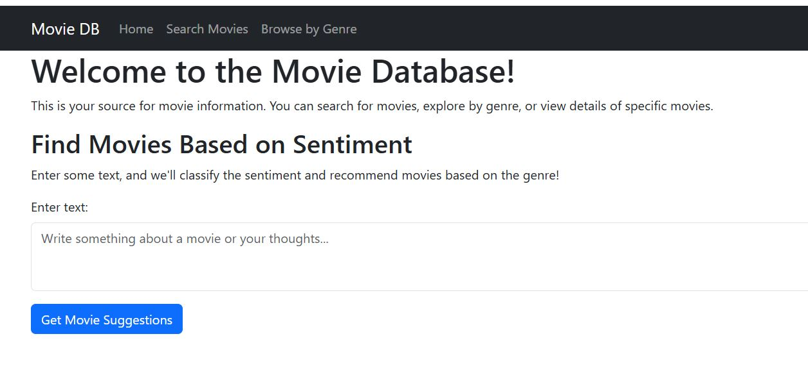

# Movie Service API

This repository contains a Flask-based web application that provides a movie service API. It allows users to fetch, search, and classify movies by title or genre and integrates with a language model for sentiment-based genre classification.




## Features

- **Home Page**: Render static pages, including a home page and predefined route pages.
- **Fetch Movies**: Retrieve a list of movies from a database.
- **Search Movies**: Search movies by title or genre.
- **Genre Classification**: Classify input text into a movie genre using an external language model API.
- **Error Logging**: Comprehensive logging for debugging and monitoring.

---


## Installation

### Prerequisites
- Python 3.8 or higher
- A database connection
- API key for the Gemini Language Model

### Steps
1. Clone the repository:
    ```bash
    git clone <repository_url>
    cd <repository_folder>
    ```

2. Set up a virtual environment and activate it:
    ```bash
    python -m venv venv
    source venv/bin/activate   # On Windows: venv\Scripts\activate
    ```

3. Install dependencies:
    ```bash
    pip install -r requirements.txt
    ```

4. Set up environment variables:
    - Create a `.env` file in the root directory.
    - Add your database credentials and API key:
        ```
        LLM_API_KEY=your_api_key_here
        ```

5. Configure the database connection in `data/db_connection.py`.

6. Run the Flask application:
    ```bash
    python app.py
    ```

---

## Endpoints

### 1. **Static Pages**
#### `GET /`
- Renders the home page.

#### `GET /<page>`
- Renders a predefined static page (`search_page` or `bygenre_page`).

---

### 2. **Movies**
#### `GET /movies`
- Fetches a list of movies from the database.
- **Response**: JSON array of movie details.

#### `GET /movie/<int:movie_id>`
- Fetches details of a specific movie by ID.
- **Response**: JSON object of movie details or error message.

---

### 3. **Search**
#### `GET /search`
- Searches for movies by title.
- **Query Params**: `title`
- **Response**: JSON array of movies matching the title.

#### `GET /bygenre`
- Searches for movies by genre.
- **Query Params**: `genre`
- **Response**: JSON array of movies matching the genre.

---

### 4. **Genre Classification**
#### `POST /classify`
- Classifies the input text into a movie genre using the Gemini API.
- **Request Body**: 
    ```json
    {
        "text": "Your input text here"
    }
    ```
- **Response**: JSON array of movies matching the classified genre.

---

## Logging

Logs are stored in `app.log` and displayed in the console. Adjust the logging level in the `logging.basicConfig()` configuration.

---

## Error Handling

The application handles:
- Database connection errors
- API request errors
- Invalid or missing input errors

---

## License

This project is licensed under the MIT License.